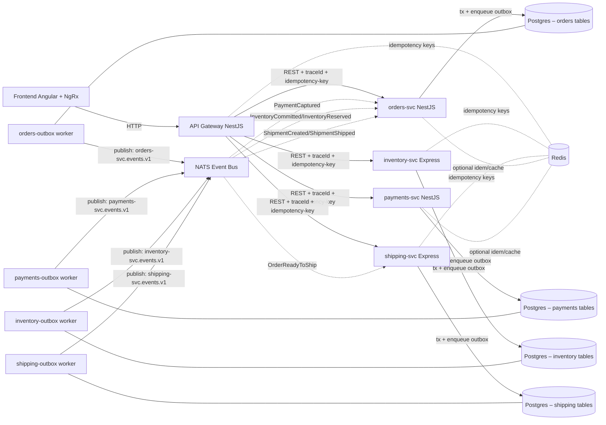

# Supply Chain Saga — Microservices Demo

A full-stack **supply chain management system** built as a distributed microservices architecture.  
It showcases **event-driven design, idempotency, trace IDs, and polyglot services** (NestJS + Express).

Designed as a **portfolio-ready project** to demonstrate production patterns like reliability, traceability, and consistency.

---

## Services

| Service                                     | Tech               | Purpose                                            |
|---------------------------------------------|--------------------|----------------------------------------------------|
| [orders-svc](./orders-svc/README.md)        | NestJS + TypeORM   | Create/approve/cancel orders (idempotent writes)   |
| [payments-svc](./payments-svc/README.md)    | NestJS + TypeORM   | Process payments with retry/void + timeline        |
| [inventory-svc](./inventory-svc/README.md)  | Express + Postgres | Reserve/commit/release/move stock across SKUs      |
| [shipping-svc](./shipping-svc/README.md)    | Express + Postgres | Create & cancel shipments; event-sourcing-lite     |
| [gateway](./gateway/README.md)              | NestJS             | Public API edge; forwards to services (HTTP)       |

---

## Architecture

## Features
Distributed tracing — W3C traceparent propagated end-to-end (also returned as X-Trace-Id).
Idempotency — all unsafe writes require an Idempotency-Key; duplicates are deduped per service.
Polyglot microservices — mix of NestJS and Express services.
Event sourcing-lite — domain events persisted and emitted via NATS for downstream consumers.
Dockerized stack — docker compose up runs Postgres, NATS, and all services.
NgRx frontend — Angular app consuming the gateway’s REST API.

## Quick Start
# Clone
git clone https://github.com/yourname/supplychain-saga.git
cd supplychain-saga

# Run with Docker (builds images on first run)
docker compose up --build

##Services (local URLs)
Gateway   → http://localhost:3000
Orders    → http://localhost:3001
Inventory → http://localhost:3002
Payments  → http://localhost:3003
Shipping  → http://localhost:3004
Postgres  → localhost:5434
NATS      → localhost:4222
Redis     → localhost:6379   (if enabled)

##Tests
# Create an order
curl -sS -X POST http://localhost:3000/orders \
  -H 'Content-Type: application/json' \
  -H 'Idempotency-Key: o-1' \
  -d '{"customerId":"C1","items":[{"sku":"SKU-1","quantity":1,"unitPrice":9.99}]}' | jq

# Reserve inventory
curl -sS -X POST http://localhost:3000/inventory/reserve \
  -H 'Content-Type: application/json' \
  -H 'Idempotency-Key: inv-1' \
  -d '{"orderId":"ORDER-1","sku":"SKU-1","quantity":1}' | jq

# Create shipment
curl -sS -X POST http://localhost:3000/shipping/shipments \
  -H 'Content-Type: application/json' \
  -H 'Idempotency-Key: ship-1' \
  -d '{"order_id":"ORDER-1"}' | jq

***
This project addresses concerns such as consistency, reliability, and observability.
It demonstrates the Gateway pattern and saga-like orchestration through explicit API contracts.
There is a clean separation of front end, edge layer, services, storage, and event bus.
